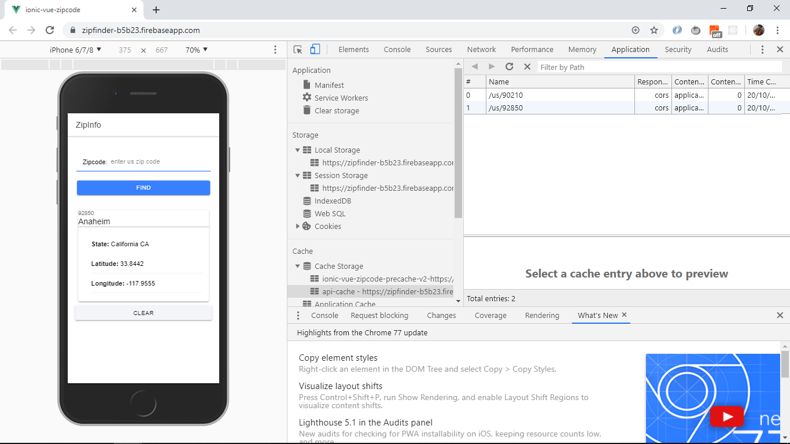

# :zap: Ionic Vue Zipcode

* App to display location information from the [zippopotam API](https://api.zippopotam.us/) based on a US zipcode user-input. This app is a Progressive Web App (PWA).
* This code is from another great tutorial by Traversy Media, [Youtube video: 'Build a PWA With Vue & Ionic 4'](https://www.youtube.com/watch?v=6H1wftPS0oo)
* **Note:** to open web links in a new window use: _ctrl+click on link_


## :page_facing_up: Table of contents

* [General info](#general-info)
* [Screenshots](#screenshots)
* [Technologies](#technologies)
* [Setup](#setup)
* [Features](#features)
* [Status](#status)
* [Inspiration](#inspiration)
* [Contact](#contact)

## :books: General info

* The user enters a US zipcode and a regex test is used to verify the format is correct. If the format is incorrect an error message is returned. If the format is correct a GET request is made to the [zippopotam API](https://api.zippopotam.us/). If it is a valid code then location data is returned in a JSON response. If the zip code is invalid then an error message is returned.
* Location data is displayed and also stored in cache to be available in the event of loss of internet (a PWA requirement).
* The app uses Firebase web hosting and is deployed to [https://zipfinder-b5b23.firebaseapp.com/](https://zipfinder-b5b23.firebaseapp.com/).

## :camera: Screenshots



## :signal_strength: Technologies

* [Ionic v4.11.1](https://ionicframework.com/)
* [Ionic/vue v0.0.4](https://ionicframework.com/)
* [Vue v2.6.10](https://vuejs.org/v2/guide/)
* [pwa plugin for vue-cli v4.0.4](https://www.npmjs.com/package/@vue/cli-plugin-pwa)
* [register-service-worker v1.6.2](https://www.npmjs.com/package/register-service-worker) to simplify service worker registration
* [Vetur tooling extension](https://vuejs.github.io/vetur/) scaffolding snippets used to save time coding.

## :floppy_disk: Setup

* To start the dev server on _localhost://3000_ type: 'npm run start'
* To create a build file type: 'npm run build'.
* The App was deployed using 'firebase deploy' to: [https://zipfinder-b5b23.firebaseapp.com/](https://zipfinder-b5b23.firebaseapp.com/)

## :computer: Code Examples

* vue.config.js with pwa configuration.

```javascript
module.exports = {
  pwa: {
    workboxPluginMode: 'GenerateSW',
    workboxOptions: {
      navigateFallback: './index.html',
      runtimeCaching: [
        {
          urlPattern: new RegExp('^https://api.zippopotam.us/us/'),
          handler: 'networkFirst',
          options: {
            networkTimeoutSeconds: 20,
            cacheName: 'api-cache',
            cacheableResponse: {
              statuses: [0, 200]
            }
          }
        }
      ]
    }
  }
};
```

## :cool: Features

* **PWA plugin for vue-cli** is configurable: e.g. workbox-webpack-plugin has 2 modes: GenerateSW and InjectManifest. Other options: themeColor, appleMobileWebAppCapable, etc. It creates a manifest.json file in the dist folder with web app resources listed: displayed name, icons, splash screen, navigation path to fall back to etc. A service worker caches location data from zipcode searches so results can be queried offline. New zipcode queries will not be made to the [zippopotam API](https://api.zippopotam.us/) until the app is back on-line.
* ion-cards are used to present location information.

## :clipboard: Status & To-do list

* Status: Working. Deployed.
* To-do: Do not update to later versions or only a white screen will display

## :clap: Inspiration

* Traversy Media: [Youtube video: 'Build a PWA With Vue & Ionic 4'](https://www.youtube.com/watch?v=6H1wftPS0oo)

## :file_folder: License

* N/A

## :envelope: Contact

* Repo created by [ABateman](https://github.com/AndrewJBateman), email: gomezbateman@yahoo.com
